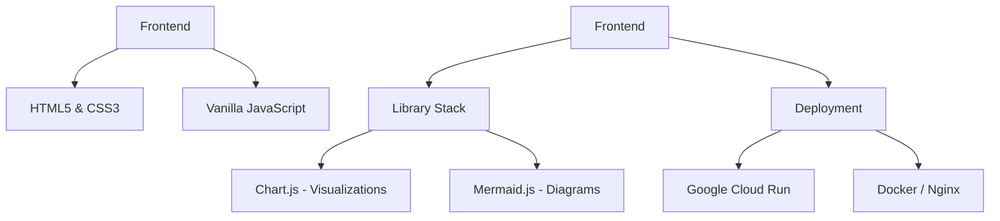
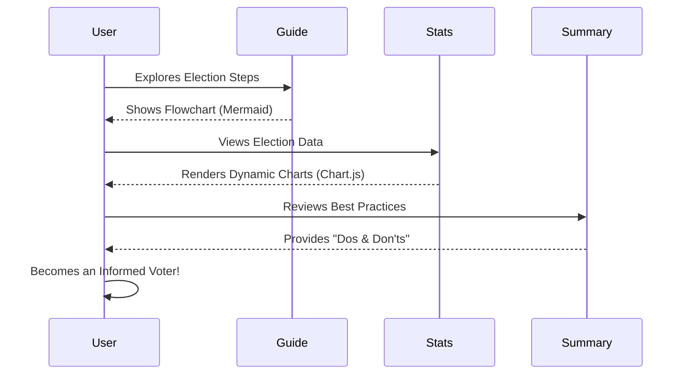

# Your Voice: The Interactive Election Guide 🗳️

**Your Voice** is a modern, responsive, and educational web application designed to guide voters through the complex process of democratic participation. Built with a focus on accessibility and user engagement, it provides clear timelines, interactive visualizations, and essential guidelines to ensure every citizen can vote with confidence.

## 🚀 Live Demo
The application is deployed on Google Cloud Run:
**[View Live Application](https://project02-service-34824184446.us-central1.run.app)**

---

## ✨ Key Features

-   **Interactive Voter Journey:** Visualized steps through the election process using Mermaid.js diagrams.
-   **Statistical Insights:** Data-driven visualizations of election metrics powered by Chart.js.
-   **Multilingual Support:** Seamless switching between multiple languages to reach a diverse audience.
-   **Election Countdown:** Real-time countdown timer to the next major election event.
-   **Voter "Dos and Don'ts":** A curated guide on best practices and common pitfalls to avoid during elections.
-   **Responsive Design:** A premium, dark-mode-first aesthetic that works beautifully on all devices.

---

## 🛠️ Technology Stack



---

## 🗺️ Voter Journey Overview

The following diagram illustrates the core flow of the voter assistance experience:



---

## 📦 Local Setup & Deployment

### Prerequisites
-   [Docker](https://www.docker.com/)
-   [Google Cloud SDK (gcloud)](https://cloud.google.com/sdk)

### Running with Docker
1. Build the image:
   ```bash
   docker build -t vote-assist .
   ```
2. Run the container:
   ```bash
   docker run -p 8080:8080 vote-assist
   ```
3. Open `http://localhost:8080` in your browser.

### Deploying to Cloud Run
The project includes a `deploy.ps1` script for automated deployment:
```powershell
./deploy.ps1
```

---

## 📄 License
This project is for educational purposes. Feel free to contribute and improve the voter experience!

---
*Created with ❤️ to empower voters everywhere.*
